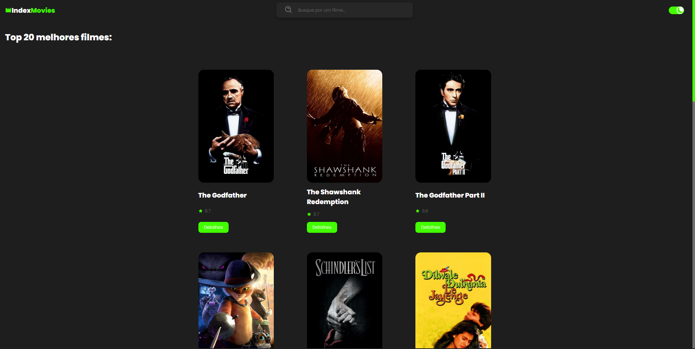

<h1 align="center">Index Movies</h1>

  <a href="#-tecnologias">Tecnologias</a>&nbsp;&nbsp;&nbsp;|&nbsp;&nbsp;&nbsp;
  <a href="#-projeto">Projeto</a>&nbsp;&nbsp;&nbsp;|&nbsp;&nbsp;&nbsp;
  <a href="#-layout">Layout</a>&nbsp;&nbsp;&nbsp;|&nbsp;&nbsp;&nbsp;

 

  

## 🚀 Tecnologias

Esse projeto foi desenvolvido com as seguintes tecnologias:

- HTML 
- CSS
- JavaScript
- React.JS
- API
- Npm

## 💻 Projeto

Este projeto é um catálogo de filmes construído com React.JS. Manipulei uma API externa(TMDB API) para exibir uma lista dos 20 melhores filmes mais bem avaliados pela comunidade da https://www.themoviedb.org/?language=pt-BR. É possível também fazer buscas individuais por seus filmes favoritos. 

## 🔖 Layout

Você pode visualizar o layout do projeto através [DESSE LINK](https://index-movies.vercel.app/).
